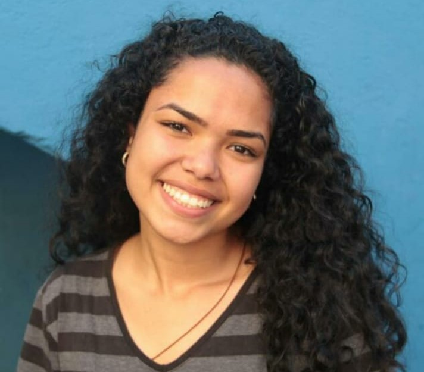

----

 

A aula esta disponível no canal KnifeCircus <a href="https://www.youtube.com/watch?v=bG2BmmYr9NQ&t=310s" > Aqui </a> 

 <a href="#objetivo">Objetivo</a> •
 <a href="#features">Features</a> • 
 <a href="#tecnologias">Tecnologias</a> •
 <a href="#licença">Licença</a> • 
 <a href="#autora">Autora</a>

### Objetivo
Nesse repositório guardo o jogo que foi proposto nessa aula. 

### Features

- [X] Criando um Flappy Bird do ZERO!!!
- [X] Troca de Tela e Gravidade
- [X] Colisão, Pulo, Web Audio API
- [X] Cenário infinito a animando o passarinho com frames
- [X] Desenhando obstáculos dinamicamento e detectando Colisão
- [X] Adicionando o Placar, Tela de game over e muito mais! 

### Tecnologias

As seguintes ferramentas foram usadas na construção do projeto:

- [Visual Studio Code](https://code.visualstudio.com/download)
- [Java Script](https://www.javascript.com/)
- [HTML](https://developer.mozilla.org/en-US/docs/Glossary/HTML5)
- [CSS3](https://developer.mozilla.org/en-US/docs/Web/CSS)

### Licença

MIT License ©

### Autora
---

<a href="https://nycole-xavierr.medium.com/">
 
  
 <b>Nycole Xavier</b></a> <a href="https://nycole-xavierr.medium.com/" title="Medium">👩‍💻</a>

Feito com ❤️ por Nycole Xavier 👋🏽 Entre em contato!

 
